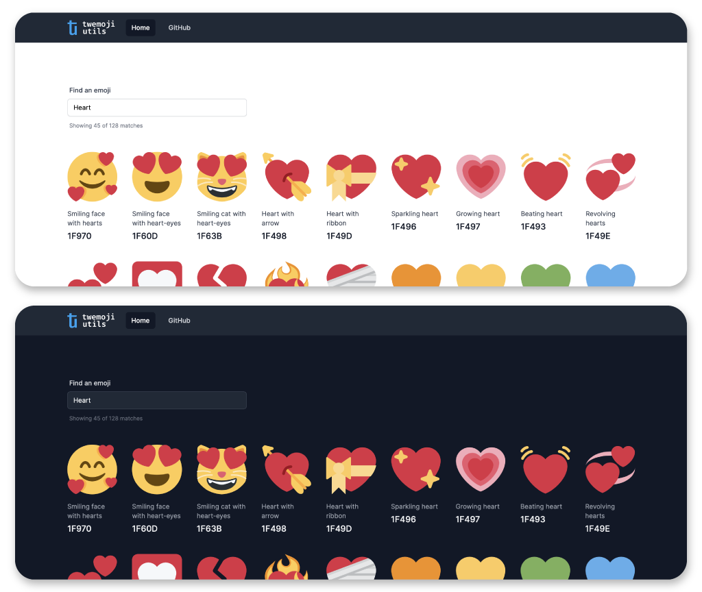

# Twemoji Utils

Find and download the perfect Twemoji assets for your designs!

If you've ever needed to find source files for Twemojis, but found it difficult to find the right ones, this is the tool for you. Easily find and download the source files for the Twemojis needed for your project.

### Home page


### Download modal


## Features

Twemoji Utils has the following features to aid you in finding the perfect Twemoji source files:

- Supports all Twemojis
- Search (filter)
- Pagination
- Download options
  - SVG
  - PNG
    - 72x72 px
    - 256x256 px
    - 512x512 px
- Open source & free to use
- Dark mode, for you programmers out there


## Project setup
```
yarn install
```

### Compiles and hot-reloads for development
```
yarn serve
```

### Compiles and minifies for production
```
yarn build
```

### Lints and fixes files
```
yarn lint
```

### Customize configuration
See [Configuration Reference](https://cli.vuejs.org/config/).
